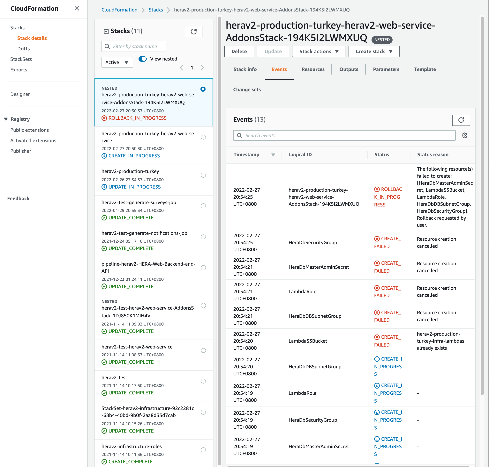
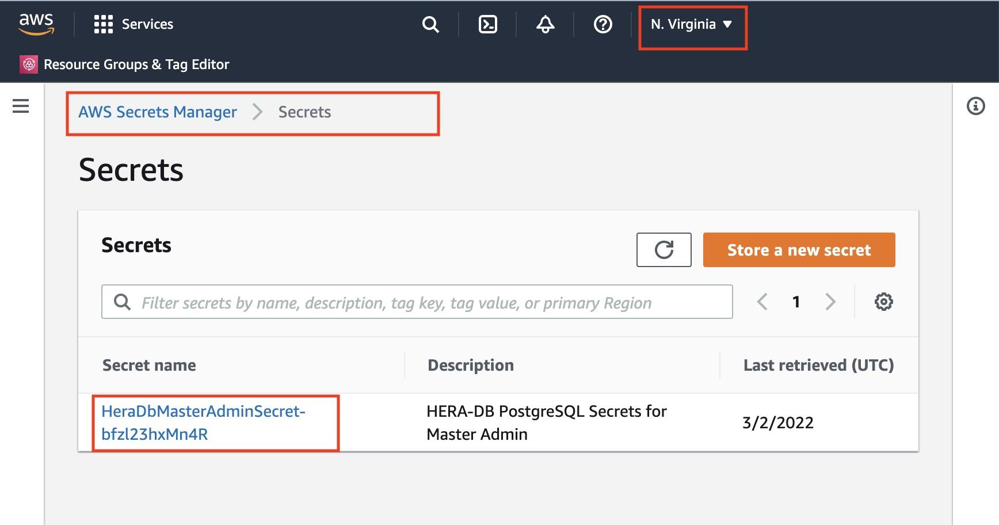
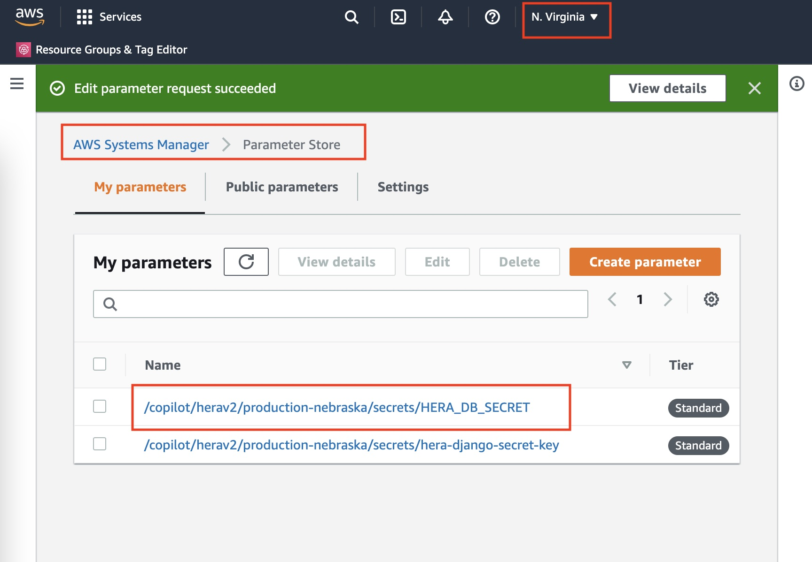
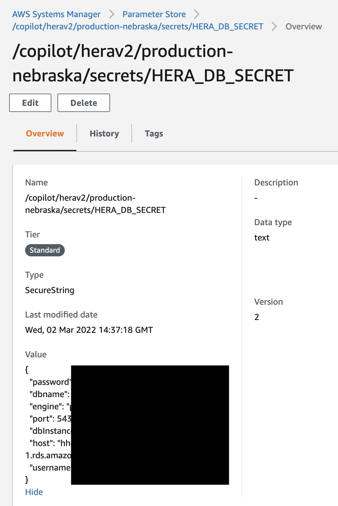

# Hera Developer Guide for Infrastructure

### Adding infrastructure resources

- You can add CloudFormation templates inside `copilot/<app>/addons` directory. 
- The added templates will be provisioned the next time you run `copilot deploy`
- View [Stack Events](https://ap-southeast-1.console.aws.amazon.com/cloudformation/home?region=ap-southeast-1#/stacks/events?filteringStatus=active&filteringText=&viewNested=true&hideStacks=false&stackId=arn%3Aaws%3Acloudformation%3Aap-southeast-1%3A725074531081%3Astack%2Fherav2-test-herav2-web-service%2Fd684a650-3f94-11ec-b6be-022e6972c664) in order to see provisioning logs and debug any problems.
 

### SSH to container

You can SSH into a container simply by typing `copilot svc exec`.
One inside, you can perform usual tasks using python manage.py script. 

## Creating New Environments

### Step 1: Deploy Service

When HERA operates in a new country, for example, it is necessary to create a new environment 
so that data from one environment does not get mixed with data from a different environment.

There are just a few steps to create a new environment and launch infrastructure in it:

1. Create new copilot environment:  `copilot env init --name YOUR_ENV_NAME --region YOUR_AWS_REGION`
   Environment name should follow `{staging/production}-{region_name}` convention e.g. `production-turkey`.
   To choose the right AWS region, please follow [this guide](https://www.concurrencylabs.com/blog/choose-your-aws-region-wisely/)

2. Generate Django secret key for this new environment: `copilot secret init --name hera-django-secret-key`
   It will prompt you to fill in values for old environments. Just press enter to skip - the old secret will not be edited.
   To generate Django secret key, please follow [this guide](https://stackoverflow.com/questions/41298963/is-there-a-function-for-generating-settings-secret-key-in-django)

3. Deploy service: `copilot svc deploy -e YOUR_ENV_NAME`.
   This will take a long time the first time as it needs to provision different infra components e.g. database, VPC, etc.

4. Run Database migration and seeding:
   1. `copilot svc -e YOUR_ENV_NAME exec`
   2. `bash`
   3. `python manage.py migrate`
   4. `python manage.py loaddata vaccines_and_doses events survey_templates`
   5. `python manage.py createsuperuser` **Please make sure you use secure username and password for production environment!**

### Sample "perfect run"

```bash
❯ copilot env init --name production-turkey --region eu-west-1
Credential source: [profile default]
Default environment configuration? Yes, use default.
✔ Linked account 725074531081 and region eu-west-1 to application herav2..

✔ Proposing infrastructure changes for the herav2-production-turkey environment.
✔ Created environment production-turkey in region eu-west-1 under application herav2.

❯ copilot secret init --name hera-django-secret-key
Test secret value:
Production-Turkey secret value:
Environment production-turkey is already on the latest version v1.7.0, skip upgrade.
...Put secret hera-django-secret-key to environment production-turkey
✔ Successfully put secret hera-django-secret-key in environment production-turkey as /copilot/herav2/production-turkey/secrets/hera-django-secret-key.
You can refer to these secrets from your manifest file by editing the `secrets` section.
`secrets:
    hera-django-secret-key: /copilot/${COPILOT_APPLICATION_NAME}/${COPILOT_ENVIRONMENT_NAME}/secrets/hera-django-secret-key`

❯ copilot svc deploy -e production-turkey
Only found one service, defaulting to: herav2-web-service

... // truncated because output is too long
4466c47: digest: sha256:33768f51c155958aa823ccb2e81460ecbc03a4c86a1dbd326ba31d119b51d3e3 size: 3270
✔ Proposing infrastructure changes for stack herav2-production-turkey-herav2-web-service
- Creating the infrastructure for stack herav2-production-turkey-herav2-web-service  [create complete]  [717.2s]
  - An Addons CloudFormation Stack for your additional AWS resources                 [create complete]  [576.8s]
    - A security group for PostgreSQL database                                       [create complete]  [5.3s]
    - A security group for your workload to access the DB instance HeraDb            [create complete]  [5.4s]
  - An autoscaling target to scale your service's desired count                      [create complete]  [0.0s]
  - Service discovery for your services to communicate within the VPC                [create complete]  [0.0s]
  - Update your environment's shared resources                                       [update complete]  [113.9s]
    - A security group for your load balancer allowing HTTP and HTTPS traffic        [create complete]  [9.5s]
    - An Application Load Balancer to distribute public traffic to your services     [create complete]  [92.7s]
  - An IAM Role for the Fargate agent to make AWS API calls on your behalf           [create complete]  [13.7s]
  - A CloudWatch log group to hold your service logs                                 [create complete]  [0.0s]
  - An ECS service to run and maintain your tasks in the environment cluster         [create complete]  [90.0s]
    Deployments
               Revision  Rollout      Desired  Running  Failed  Pending
      PRIMARY  1         [completed]  2        2        0       0
  - A target group to connect the load balancer to your service                      [create complete]  [0.0s]
  - An ECS task definition to group your containers and run them on ECS              [create complete]  [2.6s]
  - An IAM role to control permissions for the containers in your tasks              [create complete]  [17.9s]
✔ Deployed service herav2-web-service.
Recommended follow-up action:
  - You can access your service at https://herav2-web-service.production-turkey.herav2.heradigitalhealth.com over the internet.

~/freelance/hera-api master 1m 17s
❯ copilot svc -e production-turkey exec
Service herav2-web-service found in environment production-turkey
Execute `/bin/sh` in container herav2-web-service in task 8d7d0bb4e0ed464b84bd59ad07211646.

Starting session with SessionId: ecs-execute-command-05a4edab08483570c
# bash
root@ip-10-0-1-53:/code# python manage.py migrate
Operations to perform:
  Apply all migrations: admin, auth, authtoken, child_health, contenttypes, custom_user, events, otp_auth, sessions, surveys, user_profile
Running migrations:
  Applying contenttypes.0001_initial... OK
  Applying auth.0001_initial... OK
  Applying admin.0001_initial... OK
  Applying admin.0002_logentry_remove_auto_add... OK
  Applying admin.0003_logentry_add_action_flag_choices... OK
  Applying contenttypes.0002_remove_content_type_name... OK
  Applying auth.0002_alter_permission_name_max_length... OK
  Applying auth.0003_alter_user_email_max_length... OK
  Applying auth.0004_alter_user_username_opts... OK
  Applying auth.0005_alter_user_last_login_null... OK
  Applying auth.0006_require_contenttypes_0002... OK
  Applying auth.0007_alter_validators_add_error_messages... OK
  Applying auth.0008_alter_user_username_max_length... OK
  Applying auth.0009_alter_user_last_name_max_length... OK
  Applying auth.0010_alter_group_name_max_length... OK
  Applying auth.0011_update_proxy_permissions... OK
  Applying auth.0012_alter_user_first_name_max_length... OK
  Applying authtoken.0001_initial... OK
  Applying authtoken.0002_auto_20160226_1747... OK
  Applying authtoken.0003_tokenproxy... OK
  Applying child_health.0001_initial... OK
  Applying child_health.0002_alter_pregnancy_declared_pregnancy_week... OK
  Applying child_health.0003_auto_20211010_0201... OK
  Applying child_health.0004_auto_20211010_0209... OK
  Applying child_health.0005_auto_20211010_0333... OK
  Applying child_health.0006_auto_20211010_0345... OK
  Applying child_health.0007_alter_vaccine_nickname... OK
  Applying child_health.0008_alter_vaccinedose_notes_for_parent... OK
  Applying child_health.0009_vaccine_is_active... OK
  Applying child_health.0010_alter_child_gender... OK
  Applying child_health.0011_auto_20211128_1523... OK
  Applying child_health.0012_alter_pregnancy_options... OK
  Applying child_health.0013_alter_pastvaccination_unique_together... OK
  Applying custom_user.0001_initial... OK
  Applying events.0001_initial... OK
  Applying events.0002_notificationtemplate_notificationtemplatevariable_notificationtype... OK
  Applying events.0003_auto_20211211_1612... OK
  Applying events.0004_auto_20211216_1144... OK
  Applying events.0005_auto_20211217_0758... OK
  Applying events.0006_alter_notificationevent_read_at... OK
  Applying events.0007_auto_20211220_1002... OK
  Applying events.0008_notificationevent_context... OK
  Applying events.0009_alter_notificationschedule_push_time_to_live... OK
  Applying events.0010_postgres_hstore_extension... OK
  Applying events.0011_postgres_hstore_extension... OK
  Applying events.0012_alter_notificationevent_options_and_more... OK
  Applying events.0013_alter_notificationschedule_push_time_to_live... OK
  Applying events.0014_alter_notificationschedule_notification_type_and_more... OK
  Applying otp_auth.0001_initial... OK
  Applying otp_auth.0002_smsotpchallenge_otp_auth_sm_phone_n_572794_idx... OK
  Applying otp_auth.0003_alter_smsotpchallenge_options... OK
  Applying sessions.0001_initial... OK
  Applying surveys.0001_initial... OK
  Applying surveys.0002_rename_survey_survey_survey_template_and_more... OK
  Applying surveys.0003_survey_responded_at_survey_response_and_more... OK
  Applying surveys.0004_survey_available_at... OK
  Applying surveys.0005_survey_context... OK
  Applying surveys.0006_alter_survey_index_together... OK
  Applying user_profile.0001_initial... OK
  Applying user_profile.0002_alter_userprofile_date_of_birth... OK
  Applying user_profile.0003_phonenumberchangerequest... OK
  Applying user_profile.0004_onboardingprogress... OK
  Applying user_profile.0005_userprofile_language_code... OK
  Applying user_profile.0006_userprofile_timezone... OK

root@ip-10-0-1-53:/code# python manage.py loaddata vaccines_and_doses events survey_templates
Installed 47 object(s) from 3 fixture(s)

root@ip-10-0-1-53:/code# python manage.py createsuperuser
Username (leave blank to use 'root'): xxx@xxx.com
Email address: xxx@xxx.com
Password:
Password (again):
Superuser created successfully.
```

### Step 1a: What if shit happens?

Sometimes you don't get a "perfect run". Maybe you forgot to follow the steps in order, missing one step, causing deployment to fail.
Ideally, Copilot should be able to rollback the deployment perfectly to previous state so you can retry. However, sometimes this does 
not happen. These are some gotcha scenarios that may happen (please add on here if you experience a new gotcha!).


#### AddonsStack creation failed. LambdaS3Bucket CREATE_FAILED because it "already exists"

This is the screenshot from CloudFormation dashboard. Make sure you choose the correct region on the top-right of the dashboard page.



The root cause here is that AWS Copilot creates S3 bucket during deployment but does not delete it during rollback. 
The solution is to manually go to S3 dashboard and delete the offending bucket.

### Step 2: Copy DB Secrets to AWS Parameter Store

1. Go to AWS Secrets Manager, find HERA_DB_SECRET in the correct region that you have deployed to.



2. Copy the value of the secret in plaintext
3. Go to AWS Systems Manager > Parameter Store in the correct region that you have deployed to.
4. Create HERA_DB_SECRET parameter, and paste the value you have copied into it.

|  |  |
| --- | --- |

### Step 3: Deploy Jobs

It's necessary to perform this step. Otherwise, scheduled push notifications and in-app surveys will not be sent.
These jobs are run every few minutes by AWS.

```bash
❯ copilot job deploy --name generate-notifications-job --env YOUR_ENV_NAME
❯ copilot job deploy --name generate-surveys-job --env YOUR_ENV_NAME
```